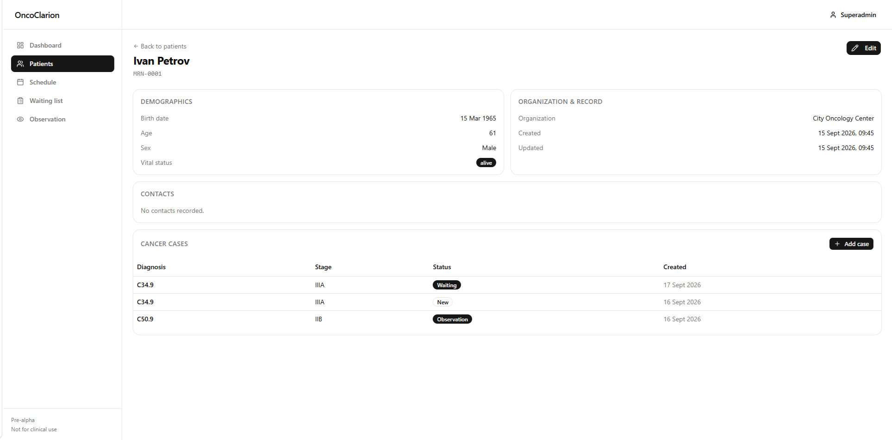
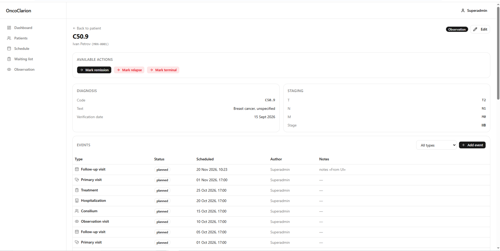
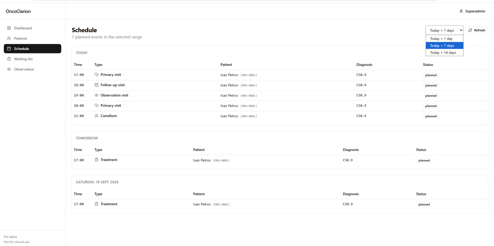

# OncoClarion

[](LICENSE)
[](https://www.python.org/)
[](https://www.djangoproject.com/)
[](https://react.dev/)
[](#testing)
[](#status)

> **An open-source web application for organizing the work of oncology dispensaries and cancer clinics.**

OncoClarion models **patient flow** — the queues and transitions that oncologists actually work with every day. Patients, cancer cases, clinical events, and the full lifecycle from primary visit to remission.

> ⚠️ **Status:** pre-alpha. Working: authentication, patient management, cancer case management with FSM lifecycle and audit trail, clinical events, and three workflow queues (Schedule, Waiting list, Observation). Not ready for clinical use.

---

## Why OncoClarion

Oncology care is not a single visit — it is a long, cyclical journey:

```
primary visit → diagnostics → tumor board → waiting list →
hospitalization → treatment → observation → (repeat) → remission
```

Most generic EMR systems model documents. OncoClarion models the **patient flow** — the queues and transitions that matter clinically.

## Demo

A 10-minute walkthrough of a complete patient journey: from registering a new patient to follow-up in the observation queue.

- [Watch on YouTube](https://youtu.be/vDniA3qLvdQ?si=navrQfeHFMwa7kFM)

## Screenshots

### Patient page with cancer cases



### Cancer case with FSM actions, events, and audit timeline



### Daily schedule — planned events grouped by day



---

## What works now

- **Authentication** with role-based access (doctor / admin).
- **Multi-tenant patient management** — every clinic sees only its own patients.
- **Patient CRUD** with search and pagination.
- **Cancer case management** with FSM lifecycle:
  - 9 statuses: `new → diagnostic → consilium → waiting_hospitalization → in_treatment → observation → remission`, plus `relapse → consilium` (cycle) and `terminal`.
  - Every transition is **audited** (who, when, why).
  - Transitions can only be performed via the FSM API.
  - **ICD-11 integration** (WHO release 2026-01, fully local):
  - Full ICD-11 MMS + Foundation synced into PostgreSQL
    (37,211 + 31,837 entities)
  - Autocomplete search by code, title, or synonym — millisecond
    response, no runtime dependency on WHO servers
  - Cancer case diagnosis linked to ICD-11 MMS entity URI,
    with deep link to the WHO ICD-11 Browser
  - **Currently limited to chapter 02 (Neoplasms) in the Case form.**
    The underlying API supports all 28 chapters; broader search can be
    enabled when the project adds comorbidity tracking or on community
    feedback.
- **Clinical events** of 6 types:
  - Primary visit, Follow-up visit, Observation visit
  - Consilium (with participants and decision)
  - Hospitalization (ward, reason, discharge date)
  - Treatment (modality, regimen, cycle tracking)
- **Three workflow queues** for daily clinical work:
  - **Schedule** — planned events for today and upcoming days.
  - **Waiting list** — cases waiting for hospitalization, sorted by waiting time.
  - **Observation** — cases under observation, sorted by time since last visit.

## Core concepts

- **Patient** — a person. Lives long, may have multiple cancer cases.
- **CancerCase** — one primary tumor with its metastases. Has a lifecycle (FSM status) and moves through queues.
- **Event** — anything that happens in time: visit, tumor board, hospitalization, treatment, follow-up. Six subtypes via multi-table inheritance.
- **Queue** — not a table, but a _view_ over cases in a given status.

See [`docs/domain.md`](docs/domain.md) for the full domain model.

## Tech stack

| Layer        | Technology                                         |
| ------------ | -------------------------------------------------- |
| Backend      | Python 3.14, Django 5.2 LTS, Django REST Framework |
| Database     | PostgreSQL 16                                      |
| Auth         | Django session-based authentication                |
| FSM          | django-fsm-2                                       |
| Frontend     | React 18, TypeScript, Vite, Tailwind v4            |
| UI           | shadcn/ui + Radix                                  |
| Server state | TanStack Query                                     |
| Infra        | Docker Compose, Caddy (planned for production)     |

See [`docs/adr/`](docs/adr/) for architecture decision records.

## Getting started

> Requires Docker Desktop.

```bash
git clone https://github.com/Sensei4/onco-clarion.git
cd onco-clarion
cp .env.example .env
docker compose up
```

- Frontend: http://localhost:5173/
- Backend API: http://localhost:8000/api/
- Django admin: http://localhost:8000/admin/

Create a superuser:

```bash
docker compose exec backend python manage.py createsuperuser
```

## Testing

```bash
docker compose exec backend pytest
```

**103 tests** covering authentication, multi-tenancy, patient CRUD, cancer cases with FSM, transitions with audit, and clinical events.

## Roadmap

See [`ROADMAP.md`](ROADMAP.md). Phase 0–2 complete. Next: referrals, documents, reports.

## Disclaimer

OncoClarion is a **research and educational project**. It is **not** a certified medical device and is **not** intended for clinical use without independent validation, regulatory review, and compliance with local laws (e.g. GDPR, HIPAA) in the jurisdiction where it is deployed. The authors take no responsibility for clinical decisions made using this software.

## Contributing

See [`CONTRIBUTING.md`](CONTRIBUTING.md). Contributions from **clinicians, medical informaticians, and developers** are welcome.

## License

Apache License 2.0. See [`LICENSE`](LICENSE).
